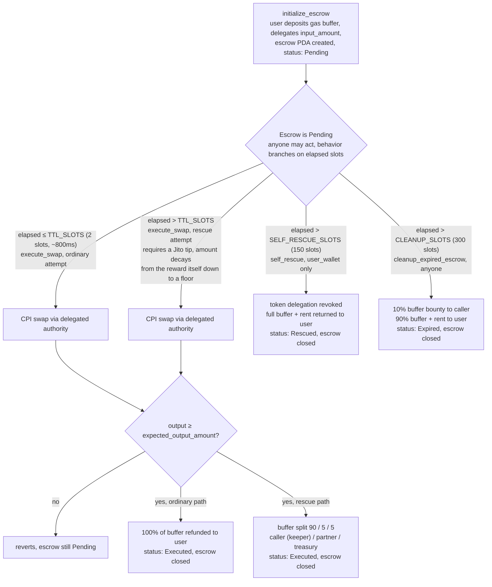

# Inertia Protocol

A Solana Anchor program that rescues stalled transactions: when a swap fails to
land within 2 slots (~800ms), a public keeper gate opens and independent
keeper bots race to get it included via Jito private bundles, earning a bounty
from a dynamic gas buffer the user posted at submission time. If no keeper
acts within 150 slots, the user reclaims the full buffer via `self_rescue`.

**Status:** early development, live on Solana devnet, unaudited, not yet on
mainnet. A continuous keeper has been running unattended against real
liquidity -- see the proof below. Full, current risk list:
[`docs/RISK_REGISTER.md`](docs/RISK_REGISTER.md).

## Live proof

- Program: [`8ST3LRU5gv8ijZehvXdwRzc6VnvqbVozCCdFzEzqhqbW`](https://explorer.solana.com/address/8ST3LRU5gv8ijZehvXdwRzc6VnvqbVozCCdFzEzqhqbW?cluster=devnet)
- **Real, genuine rescues against three independent, externally-built DEXes**, not just this repo's own test program -- [Orca Whirlpools](https://explorer.solana.com/tx/2ZxxnPvbWwZHAev7JHgTPDbmMMvyXgWqHtDeubHyD5nRk36sDmSG73FSpvYcit7KZhFUkCpX5pTyLP8dvhH4dhPT?cluster=devnet), [Raydium CPMM](https://explorer.solana.com/tx/aL3g4XTGGfKbEdaaVoX1W982ej5qCrv9mPPD8yFWSprMh6fQoKk7yAvLH4wdM5yfL5c8FiEZtUS8hANH5TiXR1p?cluster=devnet), and [Meteora DLMM](https://explorer.solana.com/tx/AKMPPdey6CSrzCMvqCsN9BDCk3Vn7SFF9kXZ1BQVacVRauBmSeyGNjKtEGSNmR7WWXtBYWCi6wTgWGQyc2cP4xd?cluster=devnet) -- three structurally different liquidity models, each integration found a different real bug. Full story: [`docs/ENGINEERING_LOG.md`](docs/ENGINEERING_LOG.md).
- **Proven under real concurrent competition**, not just single-keeper demos: two independently-keyed keeper bots racing the same live pool, every race resolving to exactly one clean winner -- [example](https://explorer.solana.com/tx/35xZnY8busagAJ28JoAstDZBMBtnxZx4S1hbEVcVsHi87DgMwfxbGAipzxyz1kcyqnprSEbmiSHYMtewW6Qh2gbN?cluster=devnet). What this does and doesn't prove: [`docs/RISK_REGISTER.md`](docs/RISK_REGISTER.md).
- Full lifecycle proof against `mock-dex` (this repo's own test program): [rescue](https://explorer.solana.com/tx/R8bBSdVKdn9XxSkuSymGn3QfRRXDs4BVkqNsXCc3FTDhHDJuXMEoipzYngTTsSP8ghQJ179Tfug9ZoQiZuDKbMg?cluster=devnet), [self-rescue](https://explorer.solana.com/tx/3dHMjRwWrQTbSvqADqAQ3Tjps3Y82pv99sxEsf7WJKmcHedyGLBuDLYr9fEWnSRdf26taddQzCbGgEpBpbZ7Dzk8?cluster=devnet), [permissionless cleanup](https://explorer.solana.com/tx/2JAs1RXurnQzPHqFV3s12krngrFFyZ6U4ek9mJAz1p1eKZMT7fM2A8RLkU3KtqkKkZitCp1e8VaBeyXFtVAvDM4x?cluster=devnet).

## Quick start

```bash
# SDK -- build swaps against a real DEX, or wrap all five instructions
cd packages/sdk && npm install && npm run build

# Reference keeper -- watches devnet, only acts once genuinely profitable
cd packages/keeper && npm install && npm run build
export INERTIA_KEEPER_KEYPAIR="/path/to/keypair.json"
npm start
```

See [`packages/sdk/README.md`](packages/sdk/README.md) and
[`packages/keeper/README.md`](packages/keeper/README.md) for real usage
examples, or [`CONTRIBUTING.md`](CONTRIBUTING.md) to build and fuzz the
on-chain program itself.

## How it works



Every threshold is a slot count, not a millisecond value, checked against
`Clock::get()?.slot` -- correct regardless of Solana's actual slot time.
`execute_swap` is the only instruction that performs the underlying swap;
`self_rescue` and `cleanup_expired_escrow` are pure fallbacks that never
touch the swap program. The rescue-path tip is anti-snipe by design: it
starts equal to the keeper's own reward right when the TTL elapses, making
pure profit-seeking sniping break-even-or-negative at the earliest
possible slot, then decays back to a normal floor. Full reasoning and the
known residual risk: [`docs/RISK_REGISTER.md`](docs/RISK_REGISTER.md).

## Full documentation

- [`docs/INSTRUCTIONS.md`](docs/INSTRUCTIONS.md) -- every instruction's accounts, params, state transitions, and errors
- [`docs/INTEGRATION_GUIDE.md`](docs/INTEGRATION_GUIDE.md) -- how to actually integrate, platform-side or keeper/DEX-integration-side
- [`docs/ECONOMIC_DESIGN.md`](docs/ECONOMIC_DESIGN.md) -- the actual buffer/split/anti-snipe-tip formulas, with real numbers worked backward from a live devnet run
- [`docs/WORKED_EXAMPLES.md`](docs/WORKED_EXAMPLES.md) -- real, running code for the full lifecycle, self-rescue, and permissionless cleanup
- [`docs/ENGINEERING_LOG.md`](docs/ENGINEERING_LOG.md) -- what was actually built and fixed, and why
- [`docs/RISK_REGISTER.md`](docs/RISK_REGISTER.md) -- every known open risk, kept current
- Rendered together at `/docs` on the site -- run it with `npm run dev --prefix site`

## Layout

- `programs/inertia-protocol/`: the on-chain program
- [`packages/sdk/`](packages/sdk/README.md): TypeScript client SDK, including three real, reusable DEX swap-builder clients ([Orca](packages/sdk/src/orcaSwap.ts), [Raydium CPMM](packages/sdk/src/raydiumCpmmSwap.ts), [Meteora DLMM](packages/sdk/src/meteoraDlmmSwap.ts)) any integrating platform can use directly
- [`packages/keeper/`](packages/keeper/README.md): reference open-source keeper bot, consuming those same SDK exports rather than special-casing them
- `trident-tests/`: Trident fuzz tests for all three fund-moving instructions -- 100k-iteration campaign, ~663,600 total instruction invocations, zero assertion panics
- `site/`: public-facing landing page and `/docs` (Next.js)

See [`CONTRIBUTING.md`](CONTRIBUTING.md) for how to actually build, test, and fuzz this locally.
