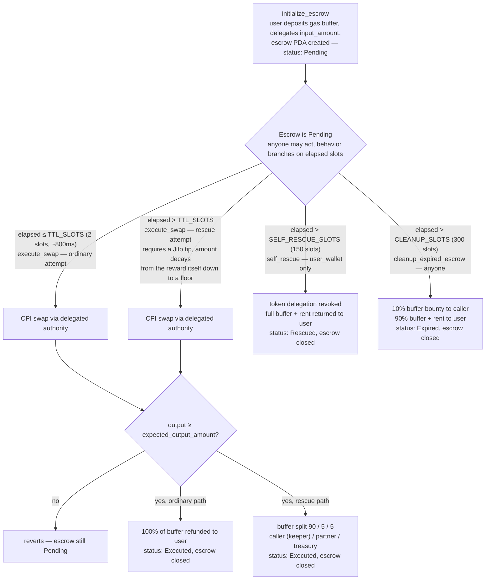

# Inertia Protocol

A Solana Anchor program that rescues stalled transactions: when a swap fails to
land within 2 slots (~800ms), a public keeper gate opens and independent
keeper bots race to get it included via Jito private bundles, earning a bounty
from a dynamic gas buffer the user posted at submission time. If no keeper
acts within 150 slots, the user reclaims the full buffer via `self_rescue`.

Status: early development. Not yet deployed anywhere.

## How it works

Every threshold above is a slot count, not a millisecond value — the contract compares
`Clock::get()?.slot` against `creation_slot + N`, so it stays correct regardless of
Solana's actual slot time. `execute_swap` is the only instruction that performs the
underlying swap; `self_rescue` and `cleanup_expired_escrow` are pure fallbacks that
never touch the swap program.

The rescue-path tip requirement is anti-snipe by design: right when the TTL elapses,
the required tip equals the keeper's own reward, making pure profit-seeking sniping
break-even-or-negative at the earliest possible slot. That requirement decays linearly
back to a normal floor over `TIP_DECAY_SLOTS` (~6 seconds), so a genuine rescue can
still happen quickly once the ratio clears. A known, documented residual risk remains:
this removes the profit motive for sniping, not the ability to act — see the design
note in `execute_swap.rs` for the full reasoning and what's still open pre-audit.

## Layout

- `programs/inertia-protocol/` — the on-chain program
- `packages/sdk/` — TypeScript integration SDK (not yet built)
- `packages/keeper/` — open source keeper bot (not yet built)
- `trident-tests/` — Trident fuzz tests for `self_rescue` and `cleanup_expired_escrow` (100k-iteration campaign, clean); `execute_swap` coverage not yet added
- `docs/` — documentation (not yet built)
