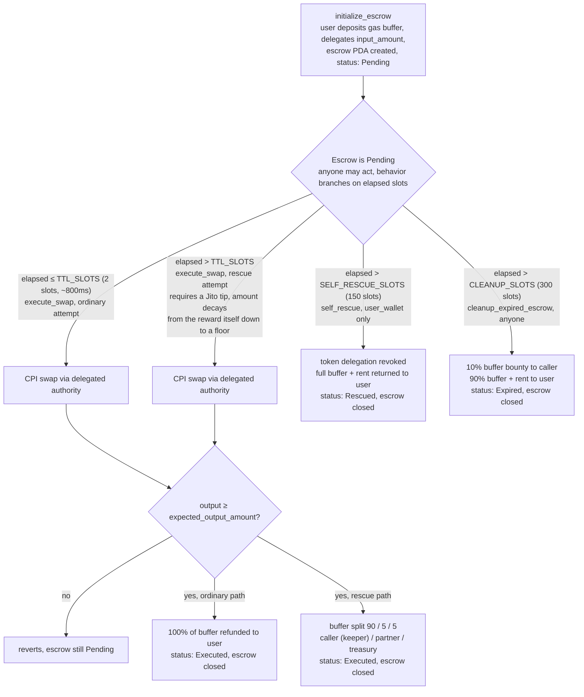

# Inertia Protocol

A Solana Anchor program that rescues stalled transactions: when a swap fails to
land within 2 slots (~800ms), a public keeper gate opens and independent
keeper bots race to get it included via Jito private bundles, earning a bounty
from a dynamic gas buffer the user posted at submission time. If no keeper
acts within 150 slots, the user reclaims the full buffer via `self_rescue`.

Status: early development. Live on Solana devnet.

- Program: [`8ST3LRU5gv8ijZehvXdwRzc6VnvqbVozCCdFzEzqhqbW`](https://explorer.solana.com/address/8ST3LRU5gv8ijZehvXdwRzc6VnvqbVozCCdFzEzqhqbW?cluster=devnet)
- **Real integration against an independently-built, externally-audited DEX**, not just this repo's own test program: [`execute_swap` CPI-ing into Orca Whirlpools](https://explorer.solana.com/tx/2ZxxnPvbWwZHAev7JHgTPDbmMMvyXgWqHtDeubHyD5nRk36sDmSG73FSpvYcit7KZhFUkCpX5pTyLP8dvhH4dhPT?cluster=devnet), a real, live devnet pool with genuine liquidity, executed as a genuine rescue (anti-snipe tip, 90/5/5 split, real swap output delivered). This is what proves the protocol is swap-venue-agnostic in practice, not just by design -- see "Generic CPI account ordering" below for why this needed a real contract change to work.
- Full lifecycle proof against `mock-dex` (this repo's own test program): a fast execution, a rescue (keeper paid 90% of the buffer) at [`R8bBSdVKdn9XxSkuSymGn3QfRRXDs4BVkqNsXCc3FTDhHDJuXMEoipzYngTTsSP8ghQJ179Tfug9ZoQiZuDKbMg`](https://explorer.solana.com/tx/R8bBSdVKdn9XxSkuSymGn3QfRRXDs4BVkqNsXCc3FTDhHDJuXMEoipzYngTTsSP8ghQJ179Tfug9ZoQiZuDKbMg?cluster=devnet), a self-rescue at [`3dHMjRwWrQTbSvqADqAQ3Tjps3Y82pv99sxEsf7WJKmcHedyGLBuDLYr9fEWnSRdf26taddQzCbGgEpBpbZ7Dzk8`](https://explorer.solana.com/tx/3dHMjRwWrQTbSvqADqAQ3Tjps3Y82pv99sxEsf7WJKmcHedyGLBuDLYr9fEWnSRdf26taddQzCbGgEpBpbZ7Dzk8?cluster=devnet), and a permissionless cleanup at [`2JAs1RXurnQzPHqFV3s12krngrFFyZ6U4ek9mJAz1p1eKZMT7fM2A8RLkU3KtqkKkZitCp1e8VaBeyXFtVAvDM4x`](https://explorer.solana.com/tx/2JAs1RXurnQzPHqFV3s12krngrFFyZ6U4ek9mJAz1p1eKZMT7fM2A8RLkU3KtqkKkZitCp1e8VaBeyXFtVAvDM4x?cluster=devnet).
- Real finding from that run, kept rather than hidden: on a public RPC, the 2-slot (~800ms) fast-path window is tight enough that ordinary network latency alone pushed multiple "should be fast" demo transactions into the rescue path -- exactly the condition this protocol exists for, hit live rather than staged.
- Not yet on mainnet. Treasury is still a devnet-only placeholder keypair (see `CONTRIBUTING.md` / the technical report's risk register).

### Generic CPI account ordering

`execute_swap` originally hardcoded its CPI account list into a fixed 4-item prefix (input token account, destination, escrow, token program) followed by whatever extra accounts the caller supplied. That only ever worked for a program built to match that exact order -- which `mock-dex` was, since this repo wrote it. Solana matches CPI accounts positionally, not by name, so a real, independently-built program like Orca Whirlpools (whose own `swap` instruction expects `[token_program, token_authority, whirlpool, token_owner_account_a, ...]`, a completely different order) could not be called at all under the old design.

`execute_swap` now takes the entire CPI account list from the caller, in whatever order the target program actually needs. The same security guarantees the old fixed prefix gave for free are preserved by explicit checks: the three security-critical accounts (the escrow's real input token account, its real expected destination, and the real SPL Token program) must each appear somewhere in the supplied list, and the escrow's own entry has its signer flag forced to `true` wherever it appears, since only `invoke_signed`'s PDA seeds can actually grant that. Verified against the existing 8-test integration suite (still 8/8) before being proven against Orca on devnet.

## How it works

Every threshold above is a slot count, not a millisecond value. The contract compares
`Clock::get()?.slot` against `creation_slot + N`, so it stays correct regardless of
Solana's actual slot time. `execute_swap` is the only instruction that performs the
underlying swap; `self_rescue` and `cleanup_expired_escrow` are pure fallbacks that
never touch the swap program.

The rescue-path tip requirement is anti-snipe by design: right when the TTL elapses,
the required tip equals the keeper's own reward, making pure profit-seeking sniping
break-even-or-negative at the earliest possible slot. That requirement decays linearly
back to a normal floor over `TIP_DECAY_SLOTS` (~6 seconds), so a genuine rescue can
still happen quickly once the ratio clears. A known, documented residual risk remains:
this removes the profit motive for sniping, not the ability to act. See the design
note in `execute_swap.rs` for the full reasoning and what's still open pre-audit.

## Layout

- `programs/inertia-protocol/`: the on-chain program
- [`packages/sdk/`](packages/sdk/README.md): TypeScript client SDK. Wraps all five instructions, mirrors the anti-snipe tip math client-side so `executeSwap()` auto-computes and attaches the correct tip
- [`packages/keeper/`](packages/keeper/README.md): reference open-source keeper bot. Discovers pending escrows, only acts once the anti-snipe curve makes it genuinely profitable, swap-execution is pluggable -- `mock-dex` (this repo's test program) and a real [Orca Whirlpools client](packages/keeper/src/orcaSwap.ts) both exist today
- `trident-tests/`: Trident fuzz tests for `self_rescue` and `cleanup_expired_escrow` (100k-iteration campaign, clean); `execute_swap` coverage not yet added
- `docs/`: documentation (not yet built)
- `site/`: public-facing landing page (Next.js). The hero is a live, honest dramatization of the actual mechanism, not decorative copy; run it with `npm run dev --prefix site`

See [`CONTRIBUTING.md`](CONTRIBUTING.md) for how to actually build, test, and fuzz this locally.
